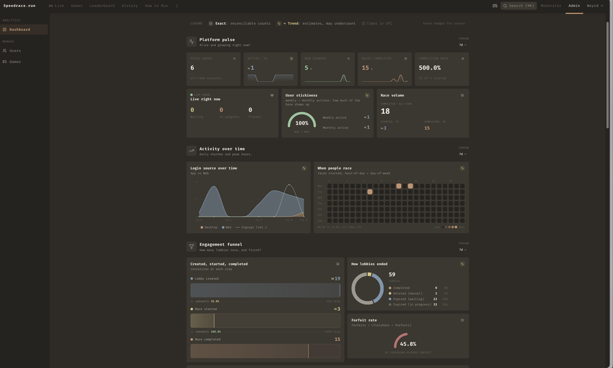
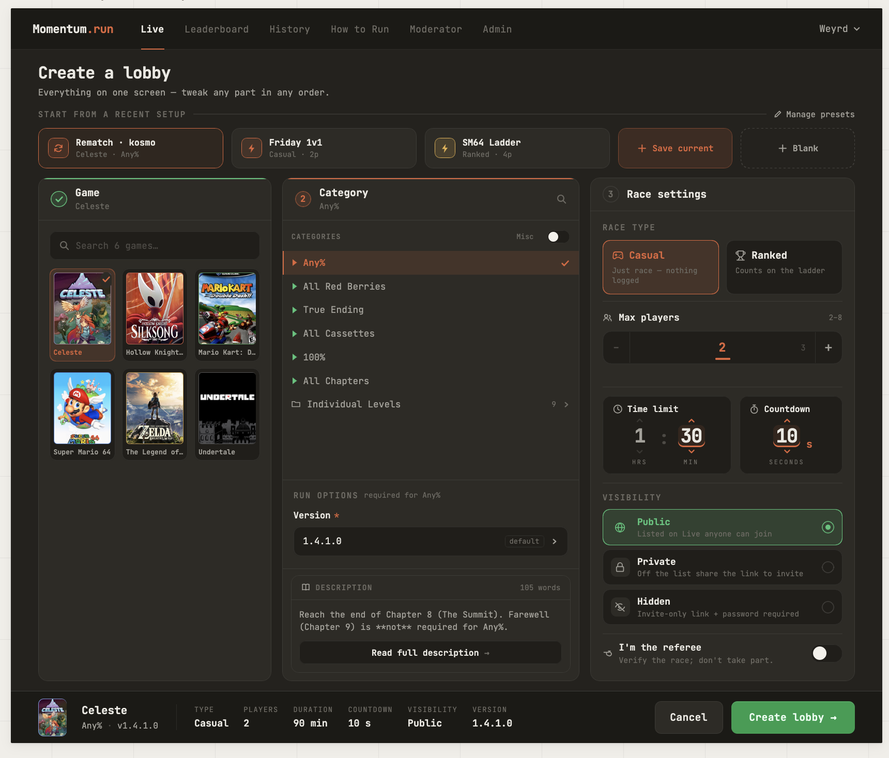
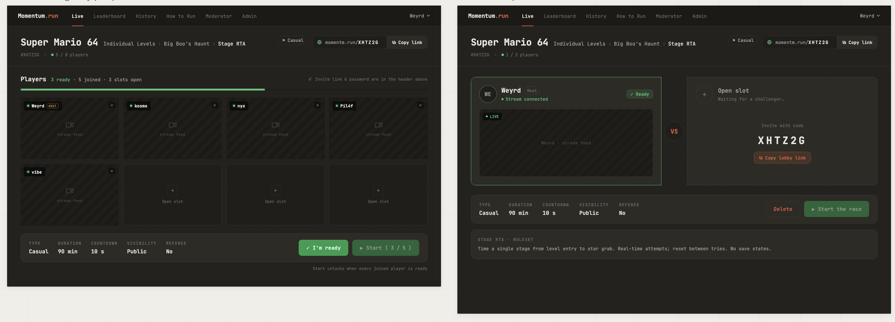
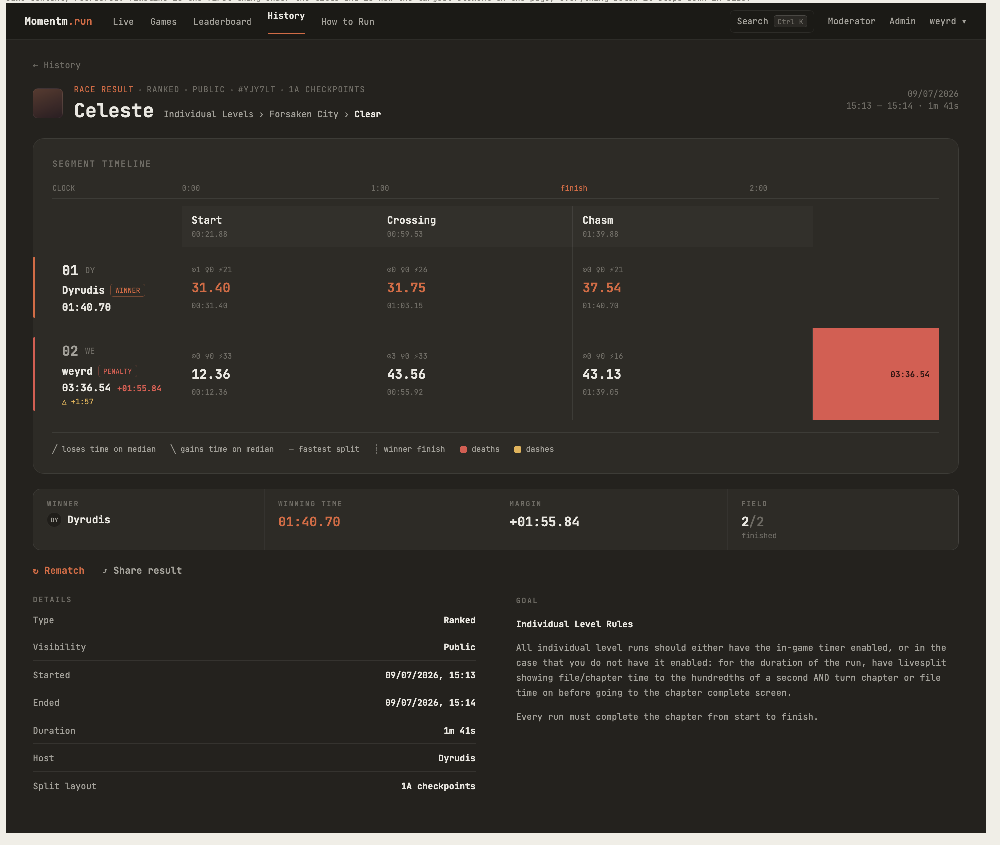

<div align="center">

# Speedrace

**The side desktop client for Speedrace.run**

[](https://github.com/Weyrd/speedrace-app/releases/latest)


</div>


## What is it?

Speedrace is a speedrun racing platform (in RTA). This app is the client a runner installs on their
own machine. It pairs with the [web version](https://github.com/Weyrd) (where you browse and
join lobbies)..

Once you're in a lobby, the app:

- capture your games windows or screen
- if an autosplitter is linked it will handle the timer for youw


(see [How it works](#how-it-works) below).


## Download & install

Grab the latest build for your OS from the **[Releases page](https://github.com/Weyrd/speedrace-app/releases/latest)**.

The app **auto-updates** itself once installed, so you only need to download it once.

> ### ⚠️ "Windows protected your PC" (SmartScreen)
>
> The Windows installer is **not code-signed** (signing certificates are expensive), so Windows
> SmartScreen will warn you the first time you run it:
>
> 
>
> click **More info -> Run anyway**.
>
> If you'd rather not trust a pre-built binary, you can **clone the repo and compile it yourself**  
> see [Build & run from source](#build--run-from-source) below.

---

<details>
<summary><b>Build &amp; run from source</b></summary>

### Prerequisites

- **[Node.js](https://nodejs.org/)** (18+) and a package manager (`pnpm` recommended, `npm` works)
- **[Rust](https://rustup.rs/)** (stable toolchain)
- The Tauri 2 platform dependencies for your OS see the
  [Tauri prerequisites guide](https://v2.tauri.app/start/prerequisites/).

### Run in development

```bash
git clone https://github.com/Weyrd/speedrace-app.git
cd speedrace-app

pnpm install
pnpm tauri dev
```

Other useful scripts:

```bash
pnpm dev      # frontend only (Vite, http://localhost:1420)
pnpm build    # type-check + bundle the frontend (tsc && vite build)
```

### Build a production bundle

```bash
pnpm tauri build  # produces installers/bundles in src-tauri/target/release/bundle/
```

On **macOS** you can build and launch an unsigned debug bundle directly:

```bash
cargo tauri build --debug --bundles app
open src-tauri/target/debug/bundle/macos/Speedrace.app
```

> The Rust side is in `src-tauri/` run `cargo build` / `cargo clippy` / `cargo check`.

</details>


## How it works

The app is a small state machine.
### 1. Log in

Launch the app and sign in. **Login via web** opens your browser, you authenticate there, and
you're redirected straight back into the app. You need to create an account on the main website first.


### 2. Wait for a lobby

Once logged in you land in the lobby. Head to the **web version** to join a race  
the app open it automatically.


### 3. Set up your stream

When you join a lobby, pick the window or screen you want to broadcast and the app connects
your stream to the race.


### 4. Race

When the race starts you go **LIVE**, your stream is active, the timer runs, and you race.
Hit **Finish** the moment you're done or **Forfeit** to drop out.


### 5. Results

When you finish, the app shows your **position** and **final time**.


## Tech stack

| Layer       | Stack                                                              |
| ----------- | ------------------------------------------------------------------ |
| Shell       | **Tauri 2** (single 400×500 window)                                |
| Frontend    | **React 18** + Vite + Tailwind v4 `useReducer` phase state machine |
| Native side | **Rust** (`src-tauri/`) OAuth, persistent WebSocket, HTTP, state   |
| Streaming   | WebRTC **WHIP**                                                    |
| Auto-update | `tauri-plugin-updater` (GitHub Releases)                           |

---

<details>
<summary><b>Releasing (maintainers)</b></summary>

Releases are driven entirely by git tags **never edit the version files by hand.**
Pushing a version tag triggers CI, which extracts the version from the tag, updates
`tauri.conf.json` / `package.json` / `Cargo.toml`, builds for Windows + Linux + macOS
(Intel + ARM) in parallel, and creates a **draft GitHub Release** to validate manually.

```bash
git tag v0.3.8
git push origin v0.3.8
```

| Tag                 | Résultat       |
| ------------------- | -------------- |
| `v0.3.8`            | release stable |
| `v0.3.8-beta.1`     | pre-release    |
| `git push` sans tag | rien           |

### git-cliff (pas encore implémenté (mainteant ca l'est))

Generate automatically git diff
[Conventional Commits](https://www.conventionalcommits.org/) (`feat:`, `fix:`, `chore:`...).
for each release it creating a Cahngelog.md automatically


</details>

## AI

Trying to keep a list of where AI was used in the project. Not exhaustive but I try to keep it up to date

Copilot inline suggestions (tab-tab) used pretty much everywhere

AI generation used for:

**App:**
- almost all documentation (in skills)
- ffmpeg recompile to build it smaller (pull + build script, `src-tauri/scripts/ffmpeg_build.sh`)
  
  <details><summary>wth is that</summary></details>
- a few debug sessions, like keybind matching physical keycode + layout stuff (azerty, qwerty, mac keyboard...)
- the architecture for loading autosplitter/livesplit + counters (disable via api, etc). It's a bit of a mess honestly, not sure it was worth it

**API:**
- global architecture / separation of concerns (first time using rust)
  <details><summary>spoiler</summary>I should've just followed the dotnet conventions i already knew, find it cleaner..if a rust dev wants to help or propose refactor yes but be readyn to suffer</details>
- all tests generated
- all bruno collections, generated (`~docs/test` postman but better)
- import route / category editor batch route
- assisted on event stats triggers get called everywhere they need to be
- probably a few debug sessions too

**Web:**
- almost all admin/mod stats components (heatmap, graphs, etc), generated (disclaimer on the page)
  
- assisted on category editor batch
- admin panel for users (roles & bans, only one shortpage)
- debugged RaceTimeline results (scale-to-time button/limit/readable, bezier lines...)
- roadmap & leaderboard placeholders
- cat picker: had two versions, AI merged them

⚠️ Also used for maquettes/mockups on complex layout & UX: timeline results, old lobby creation (redone by hand later, complete rework by hand since then execpt setting row), lobby waiting screen, how to "fold" streams in `/live` view.

Figma hates me whenever I try to use it, comes out looking horrible. If you want to help with mockups or design ideas, i`d  love that.

Web scaffolding was fully automated by the x2pip CLI (vite, tailwind, i18n, react router/query, shadcn primitives, table primitives, zod, navbar...), no AI there

Probably used in a few other spots too. I dont pay for any openai/claude/whatever subscription and try to mostly use it to assist on technical decisions and implementation direction rather than to write code for me. It does write one-off scripts (like the ffmpeg build) or basic components (stat graphs, charts...), and helps with debugging

(Massive use of tab-tab though)

### Ex maquette and generated page

- admin page stats generated
  
- lobby creation maquette (based on a few screens like the cat picker and time selector)
  
- lobby waiting maquette
  
- result page maquette
  
