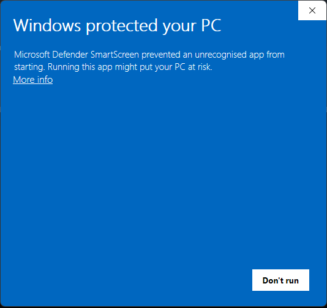
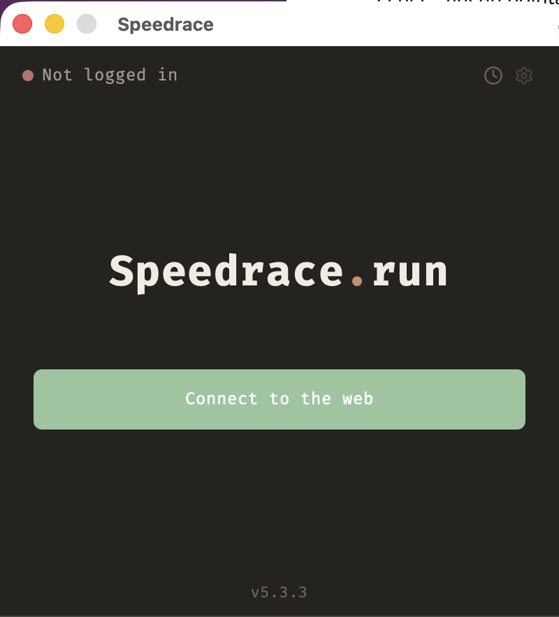
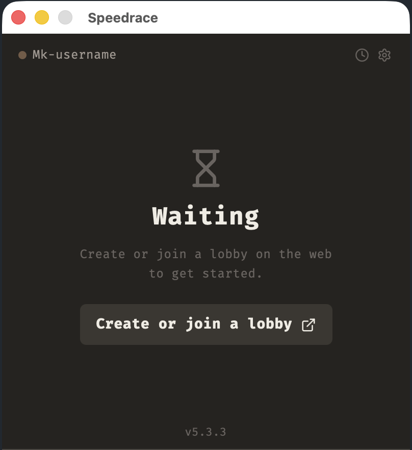
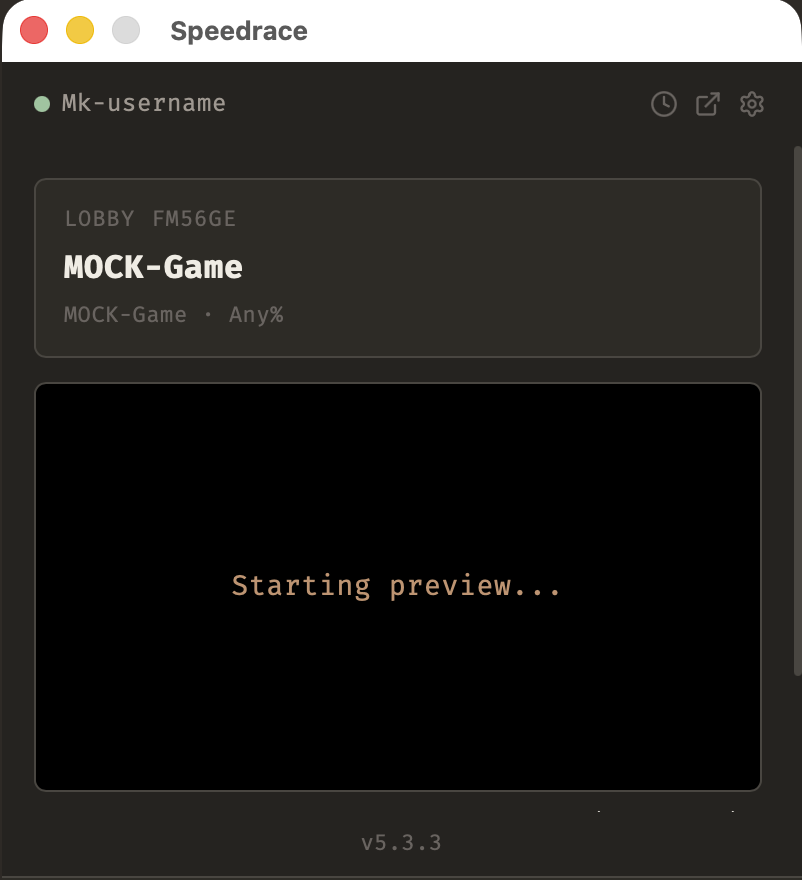
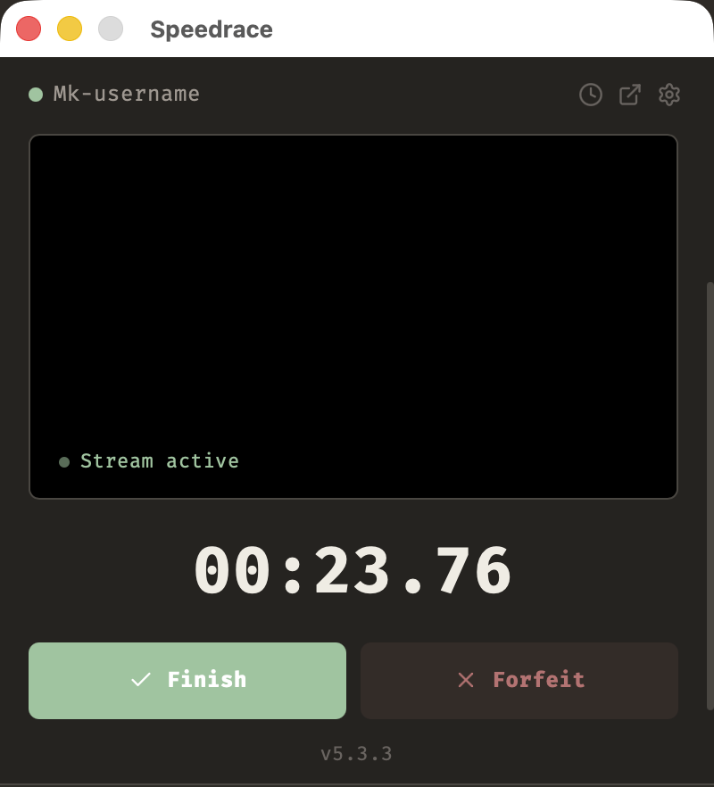
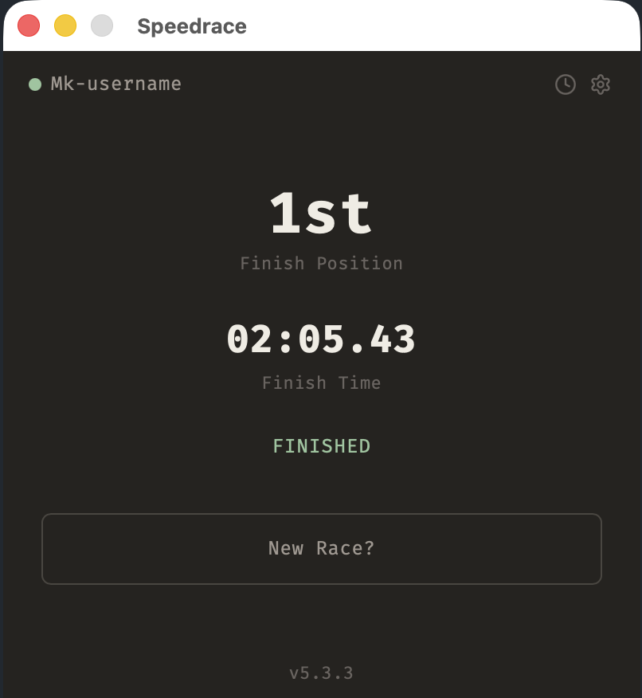
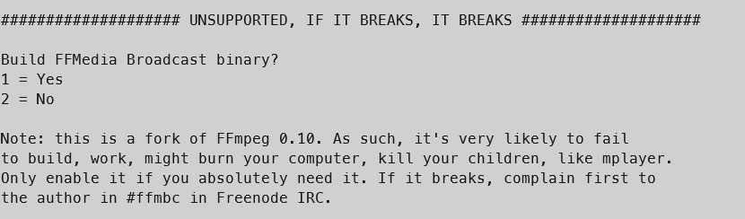

<div align="center">

# Speedrace

**The side desktop client for Speedrace.run**

[](https://github.com/Weyrd/speedrace-app/releases/latest)


</div>


## What is it?

Speedrace is a speedrun racing platform (in RTA). This app is the client a runner installs on their
own machine. It pairs with the [web version](https://github.com/Weyrd) (where you browse and
join lobbies)..

Once you're in a lobby, the app:

- capture your games windows or screen
- if an autosplitter is linked it will handle the timer for youw


(see [How it works](#how-it-works) below).


## Download & install

Grab the latest build for your OS from the **[Releases page](https://github.com/Weyrd/speedrace-app/releases/latest)**.

The app **auto-updates** itself once installed, so you only need to download it once.

> ### ⚠️ "Windows protected your PC" (SmartScreen)
>
> The Windows installer is **not code-signed** (signing certificates are expensive), so Windows
> SmartScreen will warn you the first time you run it:
>
> 
>
> click **More info -> Run anyway**.
>
> If you'd rather not trust a pre-built binary, you can **clone the repo and compile it yourself**  
> see [Build & run from source](#build--run-from-source) below.

---

<details>
<summary><b>Build &amp; run from source</b></summary>

### Prerequisites

- **[Node.js](https://nodejs.org/)** (18+) and a package manager (`pnpm` recommended, `npm` works)
- **[Rust](https://rustup.rs/)** (stable toolchain)
- The Tauri 2 platform dependencies for your OS see the
  [Tauri prerequisites guide](https://v2.tauri.app/start/prerequisites/).

### Run in development

```bash
git clone https://github.com/Weyrd/speedrace-app.git
cd speedrace-app

pnpm install
pnpm tauri dev
```

Other useful scripts:

```bash
pnpm dev      # frontend only (Vite, http://localhost:1420)
pnpm build    # type-check + bundle the frontend (tsc && vite build)
```

### Build a production bundle

```bash
pnpm tauri build  # produces installers/bundles in src-tauri/target/release/bundle/
```

On **macOS** you can build and launch an unsigned debug bundle directly:

```bash
cargo tauri build --debug --bundles app
open src-tauri/target/debug/bundle/macos/Speedrace.app
```

> The Rust side is in `src-tauri/` run `cargo build` / `cargo clippy` / `cargo check`.

</details>


## How it works

The app is a small state machine.
### 1. Log in

Launch the app and sign in. **Login via web** opens your browser, you authenticate there, and
you're redirected straight back into the app. You need to create an account on the main website first.



### 2. Wait for a lobby

Once logged in you land in the lobby. Head to the **web version** to join a race  
the app open it automatically.



### 3. Set up your stream

When you join a lobby, pick the window or screen you want to broadcast and the app connects
your stream to the race.



### 4. Race

When the race starts you go **LIVE**, your stream is active, the timer runs, and you race.
Hit **Finish** the moment you're done or **Forfeit** to drop out.



### 5. Results

When you finish, the app shows your **position** and **final time**.




## Tech stack

| Layer       | Stack                                                              |
| ----------- | ------------------------------------------------------------------ |
| Shell       | **Tauri 2** (single 400×500 window)                                |
| Frontend    | **React 18** + Vite + Tailwind v4 `useReducer` phase state machine |
| Native side | **Rust** (`src-tauri/`) OAuth, persistent WebSocket, HTTP, state   |
| Streaming   | WebRTC **WHIP**                                                    |
| Auto-update | `tauri-plugin-updater` (GitHub Releases)                           |

---

<details>
<summary><b>Releasing (maintainers)</b></summary>

Releases are driven entirely by git tags **never edit the version files by hand.**
Pushing a version tag triggers CI, which extracts the version from the tag, updates
`tauri.conf.json` / `package.json` / `Cargo.toml`, builds for Windows + Linux + macOS
(Intel + ARM) in parallel, and creates a **draft GitHub Release** to validate manually.

```bash
git tag v0.3.8
git push origin v0.3.8
```

| Tag                 | Résultat       |
| ------------------- | -------------- |
| `v0.3.8`            | release stable |
| `v0.3.8-beta.1`     | pre-release    |
| `git push` sans tag | rien           |

### git-cliff (pas encore implémenté (mainteant ca l'est))

Generate automatically git diff
[Conventional Commits](https://www.conventionalcommits.org/) (`feat:`, `fix:`, `chore:`...).
for each release it creating a Cahngelog.md automatically


</details>

AI :
Im trying to list here where i use AI in the project this list is not exhaustive but i try to keep it up to date
Use of copilot vscode integration suggestion inline (tab tab) a bit everywhere

Use of AI generation for:

in App :
- alsmot all documentations generation (in skills)
- all ffmpeg recompile build smaller (script to pull, build src-tauri/scripts/ffmpeg_build.sh etc)
(wth is that)
- few debug like "keybind matching physical keycode and layout stuff" (azerty, qwerty, mac keyboard..)
- architecture of how to load autosplitter/livesplit and counter in it (disable via api).. etc but its a mess so was it useful? idk

In API:
- global architechture in api design, separation of concern (first time using rust) ((spoiler i should have follow dotnet convention i knew, i feel like its better, if there is a rust dev who want to help me/propose refactor please do but be ready to die))
- all tests are generated
- all bruno generated (~docs/test. its a postman but better)
- import route / category editor batch route
- assisted on event stats trigger (to not miss any places it needed to be called)
- probably few debug

web:
- alsmost all stats componentes admin/mod (heatmap, graph etc) generated
- assisted for category editor batch
- admin panel user completely (roles & bans, 1 page)
- debug RaceTimeline result (scale to time debug, bezier lines, ..?)
- roadmap & leaderboard placeholder
- cat picker i had two version, ai merged them


/!\ USED IN MAQUETTE, for complex layout display UX/UI. timeline result, old lobby creation (redo by hand later by still "based" on the generated version), lobby waiting, how to "fold" stream in /live view.

Figma hate me when i try to use it, it look horrible, if ever you want to propose help or maquette or idea i would love to as well!


Web init was fully automated by x2pip CLI (vite, tailwind, i18n, react router/query, shadcn primitive, tables primitive, zod, navbar..) no ai involved

Probably used in some others places, i dont pay any subscription to openai/claude.. or whatever. i mostly use it to assist me in technical stuff and implementation lead rather than writting code. It can happen to do "one off" script like the ffmpeg build or few basic components (stats graphc, chart..) and as well for debugging.
Massive use of tabtab tho 
